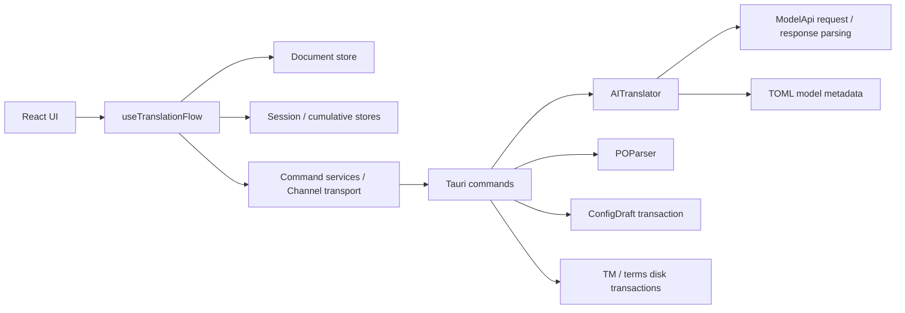

# 架构概览

核验日期：2026-10-03。本文描述当前工作树。历史方案见 [archive](archive/README.md)，本轮变化和验证见 [ArchitectureReview.md](ArchitectureReview.md)。

## 入口与边界

- 前端：React 19、TypeScript、Vite、Ant Design 6、Zustand、SWR。
- 后端：Tauri 2、Rust 2024、Tokio、serde、parking_lot。
- `src/main.tsx` 等待偏好和累计统计初始化、应用持久化语言后挂载 UI，再显示窗口。
- `src-tauri/src/main.rs` 仅调用 library 的 `run()`；模块、初始化和 handler 注册位于 `lib.rs`。可执行文件与测试使用同一服务实现。
- 当前主编辑格式是 PO。JSON 支持检测和元数据；XLIFF/YAML 元数据解析明确返回不支持错误。

## 前端状态所有权

| 状态                                        | 所有者                          | 持久化                            |
| ------------------------------------------- | ------------------------------- | --------------------------------- |
| 文档、条目、复数槽、编辑草稿、文档/条目版本 | `useTranslationStore`           | 显式保存 PO                       |
| 任务运行状态、进度、当前文档会话统计        | `useSessionStore`               | 不持久化                          |
| 累计 token、费用、翻译统计                  | `useStatsStore`                 | Tauri store                       |
| 主题、界面语言、系统明暗                    | `useAppStore`                   | 主题/语言持久化；系统明暗仅运行时 |
| 供应商、默认模型、普通设置、系统提示词      | 配置 hooks + Rust `ConfigDraft` | Rust 配置文件                     |
| 翻译记忆和术语管理草稿                      | 专用库 hooks + 管理器编辑快照   | 版本检查后提交                    |

`useTranslationFlow` 编排文件操作、确认入库、目标语言切换、翻译与取消。`useChannelTranslation` 仅处理 Channel、结果补偿与取消生命周期，使用 ref 和 callbacks，不维护第二套 UI 状态。

配置使用 `useAppConfig`、`useModelConfiguration`、`useSystemPrompt` 分别订阅 SWR key；仅读活动模型的组件使用 `useActiveAIConfig`。读取失败与成功读取空配置分开处理：失败可重试，空配置才自动打开设置。

## 数据流

普通命令经 `apiClient` 提供错误 UI，再经 `tauriInvoke` 记录脱敏日志；窗口挂载时通过 `uiFeedback` 绑定 `App.useApp()` 消息实例，保持错误提示的主题和 CSP 上下文。Channel 传输直接使用后者，由 flow 处理失败与通知。不要从组件直接调用原生 `invoke`。

## 后端职责

| 位置                                                | 职责                                                         |
| --------------------------------------------------- | ------------------------------------------------------------ |
| `commands/translator.rs`                            | PO 读写、翻译/优化 Channel、确认入库、术语操作、普通配置入口 |
| `commands/ai_config.rs`                             | 供应商与默认模型事务、连接测试、模型发现、系统提示词         |
| `commands/log.rs`                                   | 应用/前端日志读取与清理；清理 I/O 错误向上传播               |
| `services/ai_translator.rs`                         | 记忆命中、去重、提示词、三协议请求、响应解析与 usage         |
| `services/po_parser.rs`                             | rspolib 解析、保留 PO 字段、UTF-8 原子输出                   |
| `services/config_draft.rs`                          | 配置加载、校验、版本与事务持久化                             |
| `services/translation_memory.rs`、`term_library.rs` | 语言/上下文作用域与短时磁盘事务                              |
| `services/ai/`                                      | TOML 目录、供应商元数据注册表、价格与成本计算                |

请求协议是 `openai-completions`、`openai-responses`、`anthropic-messages`。供应商 trait 管理目录元数据，HTTP 执行由 `AITranslator` 按 `ModelApi` 选择；不会加载或编译插件中的 Rust 代码。

## 配置与插件

`ConfigDraft::transaction` 在一个写锁内克隆当前配置、执行修改、校验、持久化，再发布内存状态。所有配置命令使用此入口；失败不发布新状态。旧 `draft/apply/update` API 已移除。

公开配置保存为 `config.json`，凭据保存为 `config.secrets.json` 并按稳定 provider ID 定位。查询仅提供 `hasApiKey`，不返回密钥。每个文件原子替换；配置写入失败时恢复原凭据文件。界面主题/语言的唯一持久化入口是 Tauri store，加载路径来自 `get_app_settings_path`。普通模式保留 AppData 路径；便携模式使用 exe 旁 `.config/com.potranslator.gui/app-settings.json`，与后端数据同样隔离。

插件目录是 `plugins/*/plugin.toml`。debug 从源码目录加载，release 从 `resource_dir/_up_/plugins` 加载。六个内置 TOML 目录与六个快速预设是不同集合，分别维护；预设详情见 [ModelPresets.md](ModelPresets.md)。目录价目仅用于本地估算，不表示在线供应商实时价格。

目录只接受实际支持的配置字段，缓存价格缺失为 `None`，显式零价为 `Some(0)`。元数据方法借用配置字符串，不再泄漏永久字符串。移除未挂载的 providers/models 源码、旧目录翻译器和独立 file chunker；当前批次由 Channel 命令按配置分组，PO 解析仍完整读入文件。

## 文档与库的一致性

- 保存合并编辑草稿后取快照；迟到 AI 结果须匹配文档和条目版本。
- 切换文件、关闭窗口、创建目标语言文档前处理未保存修改，并取消、等待任务结束。
- 新目标语言文档清空译文，更新 Language 和 Plural-Forms，另存为新文件。
- AI 译文进入文档时标记待审核；明确确认才写入 TM。库写入成功后清除对应状态，后续人工修改继续待审核。
- TM 与术语库使用共享短时锁、revision 比较和原子替换，锁不跨 AI 请求。管理器刷新不会覆盖已有编辑快照。
- 术语按原文、上下文、规范化语言定位；精确短语约束与风格总结使用同一作用域。

## 主题与类型

主窗口在 `AppShell` 调用一次 `useThemeRuntime` 处理系统主题监听和跨窗口 emit。`useTheme` 只读状态并提供 actions；每个窗口用 `useThemeDocument` 在绘制前同步 DOM，主题切换期间禁用过渡。开发工具只读加载偏好，监听主题和语言事件，并支持异步卸载清理。两个窗口都将 Tauri style nonce 传入 `ConfigProvider`；消息使用 `App.useApp()` 上下文，暗色主题使用 `darkAlgorithm`。真实界面回归见 [UIRuntimeAudit.md](UIRuntimeAudit.md)。

设计 token 的唯一来源是 `src/index.css`。所有 UI 文案通过 i18n；两个 locale 字典按逻辑分组，运行时使用默认 `translation` namespace。

IPC payload 优先通过 Rust `ts-rs` 生成。PO、Channel、配置、文件元数据、术语库及内置短语响应直接使用生成类型；前端扩展仅保存运行时审核/草稿信息。见 [DataContract.md](DataContract.md)。

原生桌面关闭/通知、完整业务 E2E 和超大 PO 的性能边界以实际专项验证为准，不能由 mock 测试或目录中存在某个工具推断。
