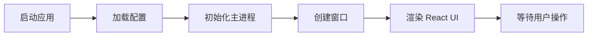

# PO 翻译工具 GUI 架构设计

> 基于 Electron + React 的桌面应用版本

## 📋 目录

- [技术栈](#技术栈)
- [项目结构](#项目结构)
- [核心功能](#核心功能)
- [数据流设计](#数据流设计)
- [开发计划](#开发计划)

---

## 🛠 技术栈

### 前端框架
```json
{
  "electron": "^28.0.0",           // 桌面应用框架
  "react": "^18.2.0",              // UI 框架
  "react-dom": "^18.2.0",          // React DOM
  "typescript": "^5.3.0"           // 类型系统
}
```

### UI 组件库
```json
{
  "antd": "^5.12.0",               // UI 组件库
  "@ant-design/icons": "^5.2.6",  // 图标库
  "styled-components": "^6.1.0"    // CSS-in-JS
}
```

### 状态管理
```json
{
  "zustand": "^4.4.7",             // 轻量级状态管理
  "immer": "^10.0.3"               // 不可变数据
}
```

### 构建工具
```json
{
  "vite": "^5.0.0",                // 快速构建工具
  "electron-builder": "^24.9.0"    // 打包工具
}
```

### Python 集成
```json
{
  "child_process": "built-in",     // 调用 Python 脚本
  "electron-store": "^8.1.0"       // 配置存储
}
```

---

## 📁 项目结构

```
ue-po-ai-translator/
├── electron-app/              # GUI 应用目录
│   ├── public/                # 静态资源
│   │   └── icon.png
│   │
│   ├── src/
│   │   ├── main/              # Electron 主进程
│   │   │   ├── index.ts       # 主进程入口
│   │   │   ├── ipc/           # IPC 通信
│   │   │   │   ├── translator.ts  # 翻译 IPC
│   │   │   │   ├── file.ts        # 文件操作 IPC
│   │   │   │   └── config.ts      # 配置 IPC
│   │   │   ├── services/      # 服务层
│   │   │   │   ├── python-bridge.ts  # Python 桥接
│   │   │   │   └── po-parser.ts     # PO 文件解析
│   │   │   └── window.ts      # 窗口管理
│   │   │
│   │   ├── renderer/          # React 渲染进程
│   │   │   ├── App.tsx        # 应用根组件
│   │   │   ├── main.tsx       # 渲染进程入口
│   │   │   │
│   │   │   ├── components/    # UI 组件
│   │   │   │   ├── Layout/
│   │   │   │   │   ├── AppLayout.tsx      # 主布局
│   │   │   │   │   ├── MenuBar.tsx        # 菜单栏
│   │   │   │   │   ├── ToolBar.tsx        # 工具栏
│   │   │   │   │   └── StatusBar.tsx      # 状态栏
│   │   │   │   │
│   │   │   │   ├── EntryList/
│   │   │   │   │   ├── EntryList.tsx      # 条目列表
│   │   │   │   │   ├── EntryItem.tsx      # 单个条目
│   │   │   │   │   └── FilterBar.tsx      # 过滤器
│   │   │   │   │
│   │   │   │   ├── Editor/
│   │   │   │   │   ├── EditorPane.tsx     # 编辑器面板
│   │   │   │   │   ├── SourceText.tsx     # 原文显示
│   │   │   │   │   ├── TranslationEditor.tsx  # 译文编辑
│   │   │   │   │   └── ActionButtons.tsx  # 操作按钮
│   │   │   │   │
│   │   │   │   ├── Settings/
│   │   │   │   │   └── SettingsModal.tsx  # 设置对话框
│   │   │   │   │
│   │   │   │   └── Common/
│   │   │   │       ├── LoadingSpinner.tsx
│   │   │   │       └── ProgressBar.tsx
│   │   │   │
│   │   │   ├── hooks/         # 自定义 Hooks
│   │   │   │   ├── useTranslator.ts   # 翻译逻辑
│   │   │   │   ├── useFileOps.ts      # 文件操作
│   │   │   │   └── useKeyboard.ts     # 快捷键
│   │   │   │
│   │   │   ├── store/         # 状态管理
│   │   │   │   ├── useAppStore.ts     # 应用状态
│   │   │   │   ├── useEntryStore.ts   # 条目状态
│   │   │   │   └── useSettingsStore.ts # 设置状态
│   │   │   │
│   │   │   ├── types/         # 类型定义
│   │   │   │   ├── entry.ts
│   │   │   │   ├── translation.ts
│   │   │   │   └── ipc.ts
│   │   │   │
│   │   │   └── utils/         # 工具函数
│   │   │       ├── format.ts
│   │   │       └── validate.ts
│   │   │
│   │   └── preload/           # 预加载脚本
│   │       └── index.ts
│   │
│   ├── package.json
│   ├── tsconfig.json
│   ├── vite.config.ts
│   └── electron-builder.json
│
├── src/                       # Python 后端（保持原有）
├── tools/
├── docs/
└── README.md
```

---

## 🎨 界面设计

### 主界面布局（类似 Poedit）

```
┌────────────────────────────────────────────────────────────┐
│  [文件] [编辑] [翻译] [视图] [帮助]          [🌙] [⚙️]     │ ← MenuBar
├────────────────────────────────────────────────────────────┤
│  [📂 打开] [💾 保存] [🤖 AI翻译] [📊 报告] [🔄 刷新]      │ ← ToolBar
├─────────────────────┬──────────────────────────────────────┤
│ 📋 条目列表 (30%)   │  📝 翻译编辑区 (70%)                │
│ ┌─────────────────┐ │ ┌──────────────────────────────────┐ │
│ │ 🔍 [搜索过滤]   │ │ │ 原文 (msgid)                     │ │
│ ├─────────────────┤ │ │ XTools|Random                    │ │
│ │ [全部▼] 844条   │ │ │                                  │ │
│ ├─────────────────┤ │ │ Context: Menu/Tools              │ │
│ │ ✅ 1. XTools... │ │ └──────────────────────────────────┘ │
│ │ ⏳ 2. Asset...  │ │ ┌──────────────────────────────────┐ │
│ │ ❌ 3. Config... │ │ │ 译文 (msgstr)                    │ │
│ │ ⚪ 4. Debug...  │ │ │ XTools|随机                      │ │
│ │ ⚪ 5. Export... │ │ │                                  │ │
│ │ ...             │ │ │ [TM 建议] Connection → 连接      │ │
│ │                 │ │ └──────────────────────────────────┘ │
│ │                 │ │                                      │ │
│ │                 │ │ [🤖 AI翻译] [💾 保存] [⏭️ 下一条]   │ │
│ └─────────────────┘ │                                      │ │
├─────────────────────┴──────────────────────────────────────┤
│ 📊 总计: 844 | ✅ 已翻译: 741 (87.8%) | ⏳ 翻译中: 0      │ ← StatusBar
└────────────────────────────────────────────────────────────┘
```

### 图标说明
- ✅ 已翻译
- ⏳ 翻译中
- ❌ 有错误
- ⚪ 未翻译
- 🔍 需审核

---

## 🔄 数据流设计

### 1. 应用启动流程



### 2. 打开文件流程

```typescript
// 用户操作
用户点击 [打开] 
  ↓
前端调用: ipcRenderer.invoke('file:open')
  ↓
主进程: 显示文件选择对话框
  ↓
主进程: 调用 Python 解析 PO 文件
  ↓
主进程: 返回解析结果
  ↓
前端: 更新 EntryStore
  ↓
界面: 显示条目列表
```

### 3. AI 翻译流程（实时更新）

```typescript
// 批量翻译
用户点击 [AI翻译全部]
  ↓
前端: 发送翻译请求 + 监听进度
  ↓
主进程: 启动 Python 翻译脚本
  ↓
Python: 逐条翻译并发送进度事件
  ↓
主进程: 转发进度 → 渲染进程
  ↓
前端: 实时更新条目状态
  ↓
界面: 条目图标变化 ⚪ → ⏳ → ✅
```

### 4. 状态管理（Zustand）

```typescript
// useEntryStore.ts
interface EntryStore {
  entries: Entry[];           // 所有条目
  currentIndex: number;       // 当前选中索引
  filter: FilterType;         // 过滤器
  translating: Set<number>;   // 翻译中的索引
  
  // Actions
  loadFile: (entries: Entry[]) => void;
  updateEntry: (index: number, msgstr: string) => void;
  setTranslating: (index: number, status: boolean) => void;
  selectEntry: (index: number) => void;
  setFilter: (filter: FilterType) => void;
}
```

---

## 🎯 核心功能模块

### 1. MenuBar（菜单栏）

```typescript
// components/Layout/MenuBar.tsx
const menuItems = [
  {
    label: '文件',
    items: [
      { label: '打开PO文件', key: 'open', shortcut: 'Ctrl+O' },
      { label: '保存', key: 'save', shortcut: 'Ctrl+S' },
      { label: '另存为', key: 'saveas', shortcut: 'Ctrl+Shift+S' },
      { label: '导出报告', key: 'export' },
      { type: 'divider' },
      { label: '退出', key: 'quit', shortcut: 'Alt+F4' }
    ]
  },
  {
    label: '翻译',
    items: [
      { label: '翻译当前条目', key: 'translate-current', shortcut: 'Ctrl+T' },
      { label: '翻译全部未翻译', key: 'translate-all', shortcut: 'Ctrl+Shift+T' },
      { label: '翻译记忆库', key: 'tm-manager' }
    ]
  },
  {
    label: '视图',
    items: [
      { label: '显示已翻译', key: 'filter-translated', type: 'checkbox' },
      { label: '显示未翻译', key: 'filter-untranslated', type: 'checkbox' },
      { type: 'divider' },
      { label: '放大', key: 'zoom-in', shortcut: 'Ctrl+=' },
      { label: '缩小', key: 'zoom-out', shortcut: 'Ctrl+-' }
    ]
  },
  {
    label: '帮助',
    items: [
      { label: '使用文档', key: 'docs' },
      { label: '快捷键', key: 'shortcuts', shortcut: 'F1' },
      { label: '关于', key: 'about' }
    ]
  }
];
```

### 2. EntryList（条目列表）

```typescript
// components/EntryList/EntryList.tsx
interface EntryListProps {
  entries: Entry[];
  currentIndex: number;
  onSelect: (index: number) => void;
  filter: FilterType;
}

const EntryList: React.FC<EntryListProps> = ({ 
  entries, 
  currentIndex, 
  onSelect,
  filter 
}) => {
  // 过滤逻辑
  const filteredEntries = useMemo(() => {
    return entries.filter(entry => {
      switch(filter) {
        case 'all': return true;
        case 'translated': return entry.msgstr;
        case 'untranslated': return !entry.msgstr;
        case 'translating': return entry.isTranslating;
        default: return true;
      }
    });
  }, [entries, filter]);
  
  return (
    <VirtualList
      data={filteredEntries}
      height={600}
      itemHeight={60}
      renderItem={(entry, index) => (
        <EntryItem
          entry={entry}
          isSelected={index === currentIndex}
          onClick={() => onSelect(index)}
        />
      )}
    />
  );
};
```

### 3. EditorPane（编辑器）

```typescript
// components/Editor/EditorPane.tsx
interface EditorPaneProps {
  entry: Entry | null;
  onSave: (translation: string) => void;
  onTranslate: () => void;
}

const EditorPane: React.FC<EditorPaneProps> = ({
  entry,
  onSave,
  onTranslate
}) => {
  const [translation, setTranslation] = useState('');
  const [tmSuggestions, setTmSuggestions] = useState<string[]>([]);
  
  // 获取 TM 建议
  useEffect(() => {
    if (entry?.msgid) {
      getTMSuggestions(entry.msgid).then(setTmSuggestions);
    }
  }, [entry?.msgid]);
  
  return (
    <div className="editor-pane">
      {/* 原文区 */}
      <SourceText 
        text={entry?.msgid} 
        context={entry?.msgctxt}
      />
      
      {/* 译文编辑区 */}
      <TranslationEditor
        value={translation}
        onChange={setTranslation}
        placeholder="输入翻译..."
      />
      
      {/* TM 建议 */}
      {tmSuggestions.length > 0 && (
        <TMSuggestions 
          suggestions={tmSuggestions}
          onApply={(text) => setTranslation(text)}
        />
      )}
      
      {/* 操作按钮 */}
      <ActionButtons
        onAITranslate={onTranslate}
        onSave={() => onSave(translation)}
        isTranslating={entry?.isTranslating}
      />
    </div>
  );
};
```

### 4. Python Bridge（Python 桥接）

```typescript
// main/services/python-bridge.ts
import { spawn } from 'child_process';
import path from 'path';

class PythonBridge {
  private pythonPath: string;
  private scriptPath: string;
  
  constructor() {
    // 开发环境使用系统 Python，生产环境使用打包的 Python
    this.pythonPath = process.env.NODE_ENV === 'production'
      ? path.join(process.resourcesPath, 'python', 'python.exe')
      : 'python';
    
    this.scriptPath = path.join(__dirname, '..', '..', 'src');
  }
  
  /**
   * 解析 PO 文件
   */
  async parsePOFile(filePath: string): Promise<Entry[]> {
    return this.runScript('parse_po.py', [filePath]);
  }
  
  /**
   * 翻译单条
   */
  async translateEntry(
    text: string, 
    apiKey: string,
    onProgress?: (progress: number) => void
  ): Promise<string> {
    return this.runScript('translate_single.py', [text, apiKey], onProgress);
  }
  
  /**
   * 批量翻译（实时进度）
   */
  async translateBatch(
    texts: string[],
    apiKey: string,
    onProgress: (index: number, translation: string) => void
  ): Promise<void> {
    const process = spawn(this.pythonPath, [
      path.join(this.scriptPath, 'batch_translate.py'),
      '--api-key', apiKey,
      '--stdin'
    ]);
    
    // 发送待翻译文本
    process.stdin.write(JSON.stringify(texts));
    process.stdin.end();
    
    // 监听实时输出
    process.stdout.on('data', (data) => {
      const result = JSON.parse(data.toString());
      onProgress(result.index, result.translation);
    });
    
    return new Promise((resolve, reject) => {
      process.on('close', (code) => {
        code === 0 ? resolve() : reject(new Error('Translation failed'));
      });
    });
  }
  
  private runScript(
    scriptName: string, 
    args: string[],
    onProgress?: (progress: number) => void
  ): Promise<any> {
    return new Promise((resolve, reject) => {
      const process = spawn(this.pythonPath, [
        path.join(this.scriptPath, scriptName),
        ...args
      ]);
      
      let output = '';
      
      process.stdout.on('data', (data) => {
        output += data.toString();
        if (onProgress) {
          // 解析进度信息
          const match = output.match(/PROGRESS:(\d+)/);
          if (match) {
            onProgress(parseInt(match[1]));
          }
        }
      });
      
      process.on('close', (code) => {
        if (code === 0) {
          try {
            resolve(JSON.parse(output));
          } catch (e) {
            resolve(output);
          }
        } else {
          reject(new Error(`Python script exited with code ${code}`));
        }
      });
    });
  }
}

export default new PythonBridge();
```

---

## 🎹 快捷键设计

```typescript
// hooks/useKeyboard.ts
const shortcuts = {
  // 文件操作
  'Ctrl+O': 'openFile',
  'Ctrl+S': 'saveFile',
  'Ctrl+Shift+S': 'saveAs',
  
  // 翻译操作
  'Ctrl+T': 'translateCurrent',
  'Ctrl+Shift+T': 'translateAll',
  
  // 导航
  'Ctrl+↑': 'previousEntry',
  'Ctrl+↓': 'nextEntry',
  'Enter': 'saveAndNext',
  
  // 视图
  'Ctrl+=': 'zoomIn',
  'Ctrl+-': 'zoomOut',
  'Ctrl+F': 'search',
  
  // 其他
  'F1': 'showHelp',
  'Esc': 'cancel'
};
```

---

## 📅 开发计划

### Phase 1: 基础框架（1周）
- [ ] 初始化 Electron + React 项目
- [ ] 配置 TypeScript + Vite
- [ ] 搭建基础 UI 布局
- [ ] 实现基本的菜单和工具栏

### Phase 2: 文件操作（1周）
- [ ] 实现打开/保存 PO 文件
- [ ] 编写 Python Bridge
- [ ] PO 文件解析和显示
- [ ] 条目列表渲染优化

### Phase 3: 编辑功能（1周）
- [ ] 编辑器组件开发
- [ ] 单条目保存
- [ ] 快捷键支持
- [ ] 撤销/重做功能

### Phase 4: AI 翻译（1周）
- [ ] 集成现有 Python 翻译脚本
- [ ] 实时进度更新
- [ ] 批量翻译队列
- [ ] 错误处理

### Phase 5: 翻译记忆库（3天）
- [ ] TM 建议显示
- [ ] TM 管理界面
- [ ] 一键应用建议

### Phase 6: 优化打磨（1周）
- [ ] 性能优化（虚拟列表）
- [ ] UI/UX 优化
- [ ] 设置面板
- [ ] 主题切换（深色模式）

### Phase 7: 打包发布（3天）
- [ ] Windows 打包
- [ ] Mac 打包
- [ ] Linux 打包
- [ ] 自动更新

**总计：约 5-6 周完成 MVP**

---

## 🚀 快速开始

### 初始化项目

```bash
# 创建 electron-app 目录
mkdir electron-app
cd electron-app

# 初始化项目
npm create vite@latest . -- --template react-ts

# 安装依赖
npm install electron electron-builder -D
npm install antd zustand immer
npm install @types/node -D

# 配置 Electron
npm install vite-plugin-electron -D
```

### 项目配置文件

详见后续的配置文档...

---

## 📚 参考资源

- [Electron 官方文档](https://www.electronjs.org/)
- [React 官方文档](https://react.dev/)
- [Ant Design](https://ant.design/)
- [Zustand](https://github.com/pmndrs/zustand)
- [Vite Plugin Electron](https://github.com/electron-vite/vite-plugin-electron)

---

**下一步：** 创建详细的组件设计文档和 IPC 通信协议

